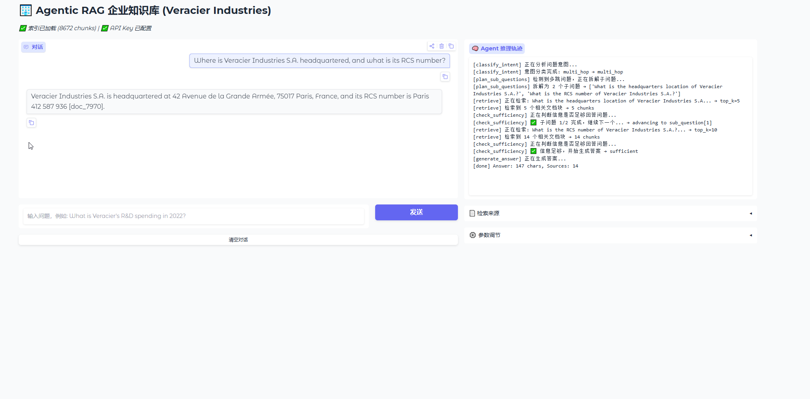

# 🏢 Agentic RAG — 企业知识库智能问答系统

基于 **LangGraph** 构建的 **Agentic RAG**（检索增强生成）系统，面向企业级文档库的智能问答。数据集采用 Veracier Industries 的约 1,100 份多语言 PDF 文档，涵盖 9 个子公司的财务、法务、技术、生产等业务文件，支持法语（53%）、英语（23%）、德语（10%）、意大利语、西班牙语五种语言。

## ✨ 核心亮点

- **7 节点 Agent 工作流** — 意图分类 → 澄清反问 / 多跳拆解 → 混合检索 → 充分性校验 → 查询改写 → 答案生成，Agent 每一步决策过程完全透明可追溯
- **混合检索引擎** — FAISS 稠密向量检索（BAAI/bge-base-en-v1.5）+ BM25 稀疏检索 + RRF（倒数排序融合），互补长短，相比纯向量检索召回率显著提升
- **多跳推理** — 复杂问题自动拆解为有序子问题链，每个子问题独立检索 + 独立校验，子问题之间共享累积上下文，retry 配额独立计算
- **流式 Web 界面** — Gradio 构建的聊天 UI，答案逐字流式输出，右侧面板实时展示 Agent 推理轨迹（每一步决策可见）和检索来源文档
- **五语言分词** — 语言感知的 NLTK punkt 句子切分，涵盖法语、英语、德语、意大利语、西班牙语，正确处理各语言特有的缩写（S.A.、GmbH、S.p.A.、S.A.R.L. 等）
- **缩写感知分块** — 自研正则回退分词器，三阶段流水线（段落分割 → 句子边界检测 → 缩写合并回补），5 语言缩写词库，递归合并链式缩写，杜绝 "M. Dupont S.A." 被切断的问题
- **OCR 完整支持** — Tesseract OCR 处理扫描件 PDF，自动检测 conda 环境中的 poppler/tesseract 路径
- **GPU 加速** — embedding 自动检测 CUDA GPU（RTX 3060 实测约 10 倍提速），回退 CPU



## 🏗 系统架构

```
用户问题
  │
  ▼
┌─────────────────┐
│  classify_intent │  意图分类（simple / multi_hop / unclear）
└───────┬─────────┘
        │
   ┌────┼────┐
   │    │    │
   ▼    ▼    ▼
 unclear  simple  multi_hop
   │    │    │
   ▼    │    ▼
 反问   │  plan_sub_questions（拆解子问题）
 终止   │    │
        ▼    ▼
   ┌─────────────────┐
   │    retrieve      │  FAISS + BM25 + RRF 混合检索
   └────────┬────────┘
            ▼
   ┌─────────────────┐
   │check_sufficiency │  LLM 判断信息是否充分
   └────────┬────────┘
            │
     ┌──────┼──────┐
     │      │      │
     ▼      ▼      ▼
  充分   不足+   不足+
        retry<3  retry=3
     │      │      │
     │      ▼      │
     │  refine_query│
     │      │      │
     │   ┌──┘      │
     │   ▼         │
     │ retrieve    │
     │ (重试)      │
     │   │         │
     └─┬─┘         │
       ▼           ▼
┌──────────────┐
│generate_answer│  流式生成答案 + [doc_N] 引用标注
└──────────────┘
```

### 关键设计决策

| 决策 | 说明 |
|------|------|
| **check_sufficiency 渐进式宽松** | retry 0：严格校验；retry 1：温和判断（有部分信息即放行）；retry 2+：自动通过，避免"穷举型"问题（如"列出所有子公司"）陷入死循环 |
| **top-k 动态递增** | 首次检索 top_k=5，第一次重试 ×2，第二次重试 ×3，扩大搜索半径以发现新文档 |
| **子问题独立 retry 配额** | 多跳场景下切换子问题时重置 retry_count，避免第一个子问题耗尽全部配额导致后续子问题被跳过 |
| **句子级分块（永不断句）** | 句子不从中切断——要么整句放入当前 chunk，要么开启新 chunk；overlap 也在句子级别计算 |

## 🚀 快速开始

### 环境要求

- **Python 3.10+**
- **Tesseract OCR**（扫描件 PDF 处理需要，可跳过）
  - Ubuntu: `sudo apt install tesseract-ocr tesseract-ocr-fra tesseract-ocr-deu tesseract-ocr-ita tesseract-ocr-spa`
  - macOS: `brew install tesseract tesseract-lang`
  - Windows: `choco install tesseract --pre`
- **poppler**（`pdf2image` 依赖，可跳过）
  - Ubuntu: `sudo apt install poppler-utils`
  - macOS: `brew install poppler`
- **LLM API Key** — 支持 DeepSeek / OpenAI / Anthropic

### 安装

```bash
# 1. 克隆项目
git clone <repo-url>
cd companyrag

# 2. 创建虚拟环境
python -m venv venv
source venv/bin/activate      # Linux/macOS
# venv\Scripts\activate       # Windows

# 3. 安装依赖
pip install -r requirements.txt

# 4. 配置 API Key
# Linux/macOS:
export DEEPSEEK_API_KEY="sk-xxxxxxxxxxxxxxxx"
export RAG_LLM_MODEL="deepseek-v4-pro"

# Windows PowerShell:
$env:DEEPSEEK_API_KEY = "sk-xxxxxxxxxxxxxxxx"
$env:RAG_LLM_MODEL = "deepseek-v4-pro"

# 5. 配置 Embedding 模型（指向本地路径或 HuggingFace 模型名）
export RAG_EMBEDDING_MODEL="E:/agentProject/embedding-model/bge-base-en-v1.5"
```

> 💡 **建议**：将 BAAI/bge-base-en-v1.5 提前下载到本地路径，避免首次运行时从 HuggingFace 下载。

### 构建索引

```bash
# 快速测试（仅处理 10 个 PDF，跳过扫描件）
python data_prepare.py --limit 10 --skip-ocr

# 标准构建（全部可搜索 PDF，跳过扫描件，推荐）
python data_prepare.py --skip-ocr

# 完整构建（全部 PDF，含 OCR 扫描件）
python data_prepare.py

# 指定本地 embedding 模型
python data_prepare.py --skip-ocr \
    --embedding-model "E:/agentProject/embedding-model/bge-base-en-v1.5"
```

生成的索引文件（已在 `.gitignore` 中排除）：
- `chunks.jsonl` — 文档块，每行一个 JSON 对象
- `faiss.index` — FAISS 向量索引（IndexFlatIP，内积 = 余弦相似度）
- `bm25_index.pkl` — BM25 稀疏索引（BM25Okapi）

### 启动 Web 界面

```bash
python app_gradio.py
# 浏览器打开 http://localhost:7860
```

界面说明：
- **左侧对话区**：聊天框，答案逐字流式出现
- **右侧推理轨迹**：实时展示 Agent 每一步决策（意图分类 → 检索 → 充分性校验 → 生成）
- **检索来源面板**：展开可查看每个 chunk 的文件路径和文本片段
- **参数滑块**：可实时调节 Top-K（1-20）和 Temperature（0-1）

> 🎬 下面是一次复杂多跳问题的完整推理过程（GIF 已做 10 倍加速，实际耗时约 60 秒）：


### 命令行用法

```bash
# 单条问答
python main.py "Veracier 2022 年的研发支出是多少？"

# 交互式 REPL
python main.py --interactive

# 批量问答（每行一个问题）
python main.py --file questions.txt

# 详细模式（输出完整推理轨迹）
python main.py --verbose "你的问题"

# 交互模式内置命令：
#   /help    — 帮助
#   /quit    — 退出
#   /status  — 查看索引和配置状态
#   /graph   — 显示工作流拓扑
```

## ⚙️ 配置参数

所有参数通过 `config.py` 的 `RAGConfig` 类管理，可用 `RAG_` 前缀的环境变量覆盖。

| 环境变量 | 默认值 | 说明 |
|----------|--------|------|
| `RAG_CHUNK_SIZE` | `512` | 分块大小（tokens） |
| `RAG_CHUNK_OVERLAP` | `128` | 分块重叠（tokens） |
| `RAG_EMBEDDING_MODEL` | `BAAI/bge-base-en-v1.5` | SentenceTransformer 模型名或本地路径 |
| `RAG_TOP_K` | `5` | 每次检索返回的文档块数量 |
| `RAG_RRF_K` | `60` | RRF 融合平滑常数 |
| `RAG_LLM_PROVIDER` | `openai` | LLM 后端：`openai` / `anthropic` |
| `RAG_LLM_MODEL` | `gpt-4o-mini` | 模型名（DeepSeek 用户须设为 `deepseek-v4-pro`） |
| `RAG_LLM_TEMPERATURE` | `0.0` | 采样温度 |
| `RAG_MAX_RETRIES` | `3` | 每个子问题的最大重试次数 |
| `RAG_OCR_LANGUAGE` | `fra+eng+deu+ita+spa` | Tesseract OCR 语言包 |
| `RAG_LOG_LEVEL` | `INFO` | 日志级别 |

> DeepSeek 用户注意：系统自动检测 `DEEPSEEK_API_KEY` 环境变量，检测到后自动切换到 DeepSeek API 端点（`https://api.deepseek.com/v1`），无需手动设置 `RAG_LLM_PROVIDER`。

## 📁 项目结构

```
companyrag/
├── config.py              # 全局配置 dataclass + GPU 设备自动检测
├── env_loader.py          # .env 文件加载 + 环境变量注入
├── llm_client.py          # LLM API 封装（OpenAI/DeepSeek/Anthropic，含流式）
├── retriever.py           # HybridRetriever 单例：FAISS + BM25 + RRF 融合
├── workflow.py            # LangGraph 7 节点工作流 + 流式包装器
├── data_prepare.py        # 数据准备流水线：PDF 提取 → 分块 → FAISS + BM25 索引
├── main.py                # CLI 入口（交互式 REPL / 单条问答 / 批量处理）
├── app_gradio.py          # Gradio Web UI（流式对话 + 推理轨迹面板）
├── test_e2e.py            # 端到端集成测试
├── test_questions.txt     # 10 条测试问题（覆盖不同难度和问题类型）
├── requirements.txt       # Python 依赖清单
├── .env.template          # 环境变量模板
├── .gitignore
├── veracier-industries/   # EDITH 数据集（约 1,100 个 PDF）
└── document/              # 设计文档与版本历史
    ├── MVP.txt            # 原始 MVP 精确设计
    ├── v0_1_0.txt         # v0.1 需求文档
    ├── v010.txt           # v0.1 改动说明
    ├── v020.txt           # v0.2 改进说明
    ├── v0.3需求.txt        # v0.3 需求文档
    ├── v0.3说明.txt        # v0.3 实现说明
    ├── v0.3修复.txt        # v0.3 启动修复记录
    ├── v0.3.1说明.txt      # v0.3.1 改进说明（最新）
    ├── 说明.txt            # 项目总体说明
    └── 虚拟环境路径.txt     # conda 环境路径
```

## 🧪 测试

```bash
# 端到端测试（需要索引 + LLM API Key）
python test_e2e.py --verbose --limit 5
```

测试问题集 `test_questions.txt` 包含 10 条精心设计的题目，覆盖：

| # | 类型 | 示例 |
|---|------|------|
| 1 | 精确数值查询 | R&D spending 2022 |
| 2 | 计数 + 地理分布 | 子公司数量及所在国家 |
| 3 | 跨年对比 | 2021 vs 2022 收入增长 |
| 4 | 风险因素提取 | 供应链中断风险 |
| 5 | 人名/角色抽取 | 董事会成员及职位 |
| 6 | 战略性问题 | 亚洲市场扩展策略 |
| 7 | 财务占比计算 | 营销支出占收入百分比 |
| 8 | 多维度总结 | ESG 举措 |
| 9 | 技术/IP 检索 | 可持续包装专利 |
| 10 | 前瞻性陈述 | 未来三年 CAPEX 计划 |

## 📊 数据规模

| 指标 | 数值 |
|------|------|
| 处理 PDF 数 | 1,022（100%） |
| 文档块总数 | 8,672 |
| Embedding 维度 | 768（bge-base-en-v1.5） |
| FAISS 索引大小 | ~26.6 MB |
| BM25 索引大小 | ~17 MB |
| GPU 加速比 | ~10x（RTX 3060 Laptop vs CPU） |
| 支持语言 | 法语、英语、德语、意大利语、西班牙语 |

## 🔧 已知限制

- **单轮问答** — 每次提问独立处理，暂不支持多轮对话上下文
- **无用户认证** — 单用户模式，无会话管理
- **无 Cross-encoder 重排序** — 检索仅依赖 FAISS + BM25 的 RRF 融合
- **OCR 质量依赖源文件** — 扫描件识别效果取决于原始 PDF 清晰度
- **无语义缓存** — 相似问题会重新执行完整流水线
- **Embedding 模型** — bge-base-en-v1.5 为英文优化，非英语文档的召回率可能偏低

## 🗺 后续规划

详见 `document/IMPROVEMENT_NOTES_2026-06-17.md`，主要方向包括：

- 多轮对话支持
- Cross-encoder 重排序提升检索精度
- 语义缓存减少重复 LLM 调用
- 使用 `graph.astream_events()` 重构流式逻辑，消除 `run_workflow_streaming()` 与 `build_graph()` 的代码重复
- Docker 容器化部署
- 检索历史持久化与日志系统

---

**技术栈**：[LangGraph](https://github.com/langchain-ai/langgraph) · [FAISS](https://github.com/facebookresearch/faiss) · [Gradio](https://github.com/gradio-app/gradio) · [BGE Embeddings](https://huggingface.co/BAAI/bge-base-en-v1.5) · [DeepSeek](https://platform.deepseek.com/) · [NLTK](https://www.nltk.org/) · [PyMuPDF](https://pymupdf.readthedocs.io/)
