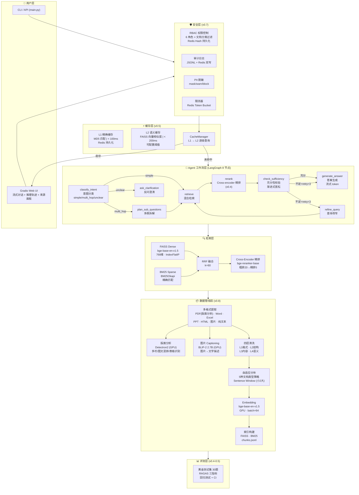
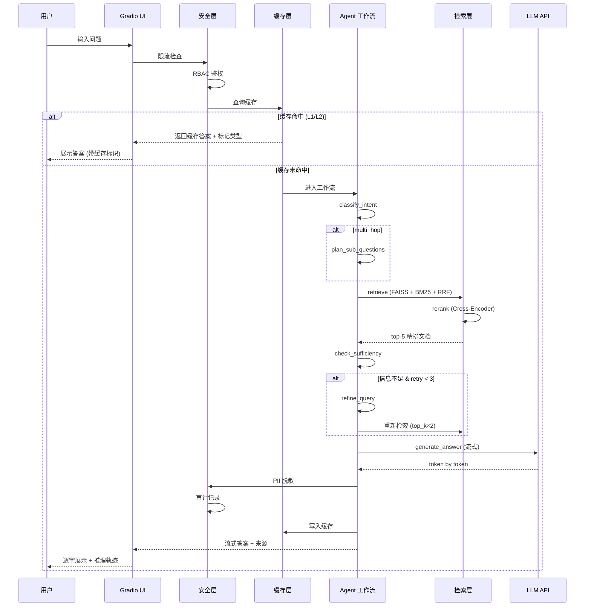
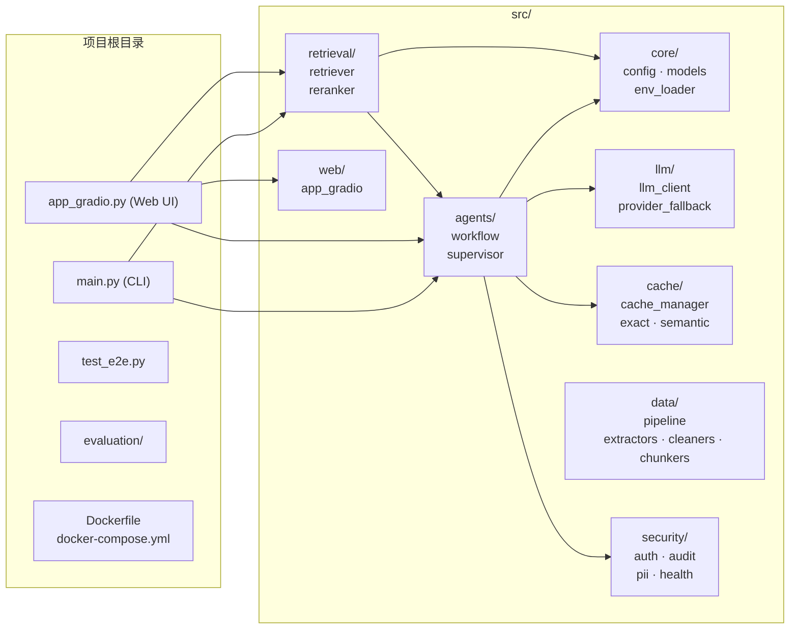
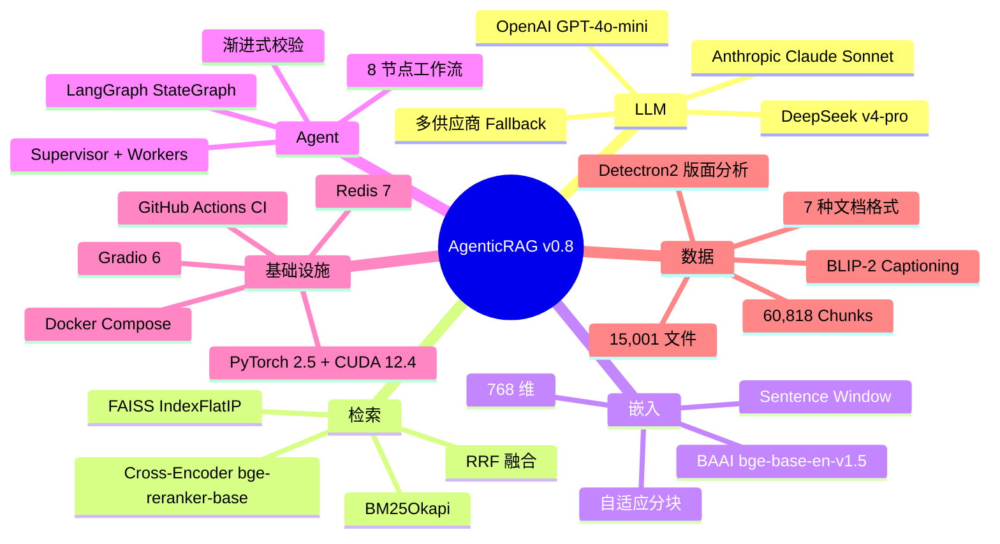

# AgenticRAG v0.8 系统架构图

> 面试用 — 可直接复制到 GitHub README 或支持 Mermaid 的 Markdown 编辑器中渲染。

## 全链路架构

```mermaid
graph TB
    subgraph 用户层["👤 用户层"]
        UI["Gradio Web UI<br/>流式对话 + 推理轨迹 + 来源面板"]
        CLI["CLI / API (main.py)"]
    end

    subgraph 安全层["🛡️ 安全层 (v0.7)"]
        RBAC["RBAC 权限控制<br/>6 角色 × 文档分类过滤<br/>Redis Hash 持久化"]
        Audit["审计日志<br/>JSONL + Redis 双写"]
        PII["PII 脱敏<br/>mask/warn/block"]
        RL["限流器<br/>Redis Token Bucket"]
    end

    subgraph 缓存层["⚡ 缓存层 (v0.5)"]
        L1["L1 精确缓存<br/>MD5 匹配 | < 100ms<br/>Redis 持久化"]
        L2["L2 语义缓存<br/>FAISS 向量相似度 | < 200ms<br/>可配置阈值"]
        CM["CacheManager<br/>L1 → L2 逐级查询"]
    end

    subgraph Agent层["🧠 Agent 工作流层 (LangGraph 8 节点)"]
        direction LR
        N1["classify_intent<br/>意图分类<br/>simple/multi_hop/unclear"]
        N2["plan_sub_questions<br/>多跳拆解"]
        N3["retrieve<br/>混合检索"]
        N4["rerank<br/>Cross-encoder 精排<br/>(v0.4)"]
        N5["check_sufficiency<br/>充分性校验<br/>渐进式宽松"]
        N6["refine_query<br/>查询改写"]
        N7["generate_answer<br/>答案生成<br/>流式 token"]
        N8["ask_clarification<br/>反问澄清"]

        N1 -->|simple| N3
        N1 -->|multi_hop| N2
        N1 -->|unclear| N8
        N2 --> N3
        N3 --> N4
        N4 --> N5
        N5 -->|充分| N7
        N5 -->|不足+retry<3| N6
        N5 -->|不足+retry=3| N7
        N6 --> N3
    end

    subgraph 检索层["🔍 检索层"]
        direction LR
        Dense["FAISS Dense<br/>bge-base-en-v1.5<br/>768维 · IndexFlatIP"]
        Sparse["BM25 Sparse<br/>BM25Okapi<br/>精确匹配"]
        RRF["RRF 融合<br/>k=60"]
        CE["Cross-Encoder 精排<br/>bge-reranker-base<br/>粗排20→精排5"]
        Dense --> RRF
        Sparse --> RRF
        RRF --> CE
    end

    subgraph 数据管线["📦 数据管线段 (v0.8)"]
        direction TB
        Ingest["多格式提取<br/>PDF(版面分析) · Word · Excel<br/>PPT · HTML · 图片 · 纯文本"]
        OCR["版面分析<br/>Detectron2 (GPU)<br/>多栏/图文混排/表格识别"]
        Caption["图片 Captioning<br/>BLIP-2 2.7B (GPU)<br/>图片→文字描述"]
        Clean["四层清洗<br/>L1格式 · L2结构<br/>L3内容 · L4语义"]
        Chunk["自适应分块<br/>5种文档类型策略<br/>Sentence Window (小2大)"]
        Embed["Embedding<br/>bge-base-en-v1.5<br/>GPU · batch=64"]
        Index["索引构建<br/>FAISS · BM25<br/>chunks.jsonl"]

        Ingest --> OCR
        Ingest --> Caption
        Ingest --> Clean
        Clean --> Chunk
        Chunk --> Embed
        Embed --> Index
    end

    subgraph 评测层["📊 评测层 (v0.4-0.5)"]
        Test["黄金测试集 30题<br/>RAGAS 三指标<br/>回归测试 + CI"]
    end

    UI --> 安全层
    CLI --> 安全层
    安全层 --> CM
    CM -->|命中| UI
    CM -->|未命中| Agent层
    Agent层 --> 检索层
    检索层 --> 数据管线
    数据管线 --> 评测层
```

## 数据流时序

```mermaid
sequenceDiagram
    participant U as 用户
    participant G as Gradio UI
    participant S as 安全层
    participant C as 缓存层
    participant A as Agent 工作流
    participant R as 检索层
    participant L as LLM API

    U->>G: 输入问题
    G->>S: 限流检查
    S->>S: RBAC 鉴权
    S->>C: 查询缓存
    alt 缓存命中 (L1/L2)
        C-->>G: 返回缓存答案 + 标记类型
        G-->>U: 展示答案 (带缓存标识)
    else 缓存未命中
        C->>A: 进入工作流
        A->>A: classify_intent
        alt multi_hop
            A->>A: plan_sub_questions
        end
        A->>R: retrieve (FAISS + BM25 + RRF)
        R->>R: rerank (Cross-Encoder)
        R-->>A: top-5 精排文档
        A->>A: check_sufficiency
        alt 信息不足 & retry < 3
            A->>A: refine_query
            A->>R: 重新检索 (top_k×2)
        end
        A->>L: generate_answer (流式)
        L-->>A: token by token
        A->>S: PII 脱敏
        S->>S: 审计记录
        A->>C: 写入缓存
        A-->>G: 流式答案 + 来源
        G-->>U: 逐字展示 + 推理轨迹
    end
```

## 项目结构

```mermaid
graph LR
    subgraph src["src/"]
        core["core/<br/>config · models<br/>env_loader"]
        llm["llm/<br/>llm_client<br/>provider_fallback"]
        retrieval["retrieval/<br/>retriever<br/>reranker"]
        agents["agents/<br/>workflow<br/>supervisor"]
        cache["cache/<br/>cache_manager<br/>exact · semantic"]
        data["data/<br/>pipeline<br/>extractors · cleaners · chunkers"]
        security["security/<br/>auth · audit<br/>pii · health"]
        web["web/<br/>app_gradio"]
    end

    subgraph root["项目根目录"]
        main["main.py (CLI)"]
        app["app_gradio.py (Web UI)"]
        tests["test_e2e.py"]
        eval["evaluation/"]
        dock["Dockerfile<br/>docker-compose.yml"]
    end

    main --> agents
    main --> retrieval
    app --> web
    app --> agents
    app --> retrieval
    agents --> core
    agents --> llm
    agents --> cache
    agents --> security
    retrieval --> core
    retrieval --> agents
```

## 技术栈

```mermaid
mindmap
  root((AgenticRAG v0.8))
    LLM
      DeepSeek v4-pro
      OpenAI GPT-4o-mini
      Anthropic Claude Sonnet
      多供应商 Fallback
    检索
      FAISS IndexFlatIP
      BM25Okapi
      RRF 融合
      Cross-Encoder bge-reranker-base
    嵌入
      BAAI bge-base-en-v1.5
      768 维
      Sentence Window
      自适应分块
    Agent
      LangGraph StateGraph
      8 节点工作流
      Supervisor + Workers
      渐进式校验
    基础设施
      PyTorch 2.5 + CUDA 12.4
      Redis 7
      Gradio 6
      Docker Compose
      GitHub Actions CI
    数据
      15,001 文件
      60,818 Chunks
      7 种文档格式
      BLIP-2 Captioning
      Detectron2 版面分析
```
